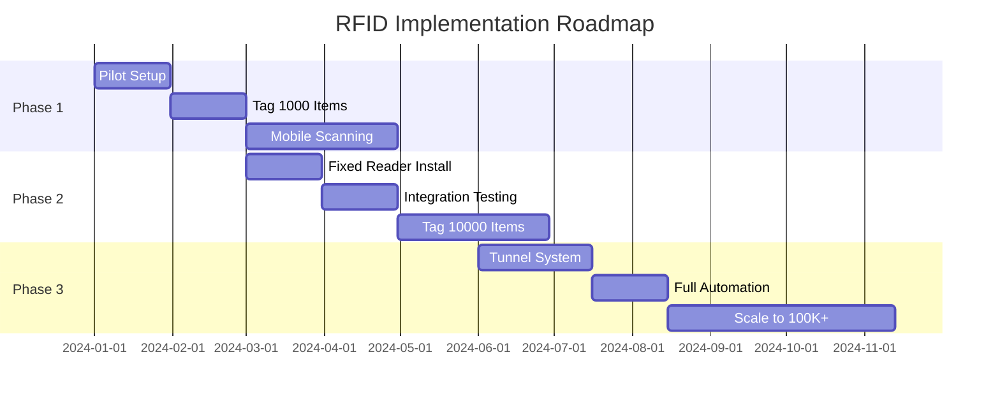

# RFID Implementation Guide for Docket Tracking System

## Overview
This guide incorporates industry best practices for implementing RFID tracking in government facilities, based on real-world warehouse and asset tracking experiences.

## 1. RFID Tag Strategy

### Tag Types by Use Case

#### Dockets & Documents (Thin Labels)
- **Type**: Wet inlay RFID tags / Label tags
- **Specs**: Thin, flexible, adhesive-backed
- **Encoding**: Pre-encoded with unique serial numbers
- **Application**: Direct adhesion to file folders, evidence bags
- **Recommended**: Zebra ZBR2000, Impinj M730

#### Evidence Items (Durable Tags)
- **Type**: Hard tags with protective casing
- **Specs**: Rugged, tamper-evident, weatherproof
- **Encoding**: Linked to evidence chain of custody
- **Application**: Attached via cable ties or adhesive
- **Recommended**: Alien Squiggle, Confidex Survivor

#### Equipment & Tools (Metal-Mount Tags)
- **Type**: On-metal RFID tags
- **Specs**: Designed for metal surfaces, high durability
- **Encoding**: Asset ID linked to maintenance records
- **Application**: Permanent mounting on equipment
- **Recommended**: Omni-ID Exo, Xerafy Titanium Metal Skin

## 2. Tag Programming & Encoding

### Initial Setup Process
```javascript
// Tag encoding workflow
const tagEncodingProcess = {
  step1: "Scan pre-encoded tag's unique EPC",
  step2: "Link EPC to object in database",
  step3: "Optional: Write user memory with object code",
  step4: "Print visual label with barcode backup",
  step5: "Apply tag and verify read"
};
```

### Database Schema Update
```sql
-- Add RFID-specific fields to objects table
ALTER TABLE objects ADD COLUMN IF NOT EXISTS 
  tag_type VARCHAR(50), -- 'label', 'hard_tag', 'metal_mount'
  tag_manufacturer VARCHAR(100),
  tag_model VARCHAR(100),
  epc_memory VARCHAR(128), -- Electronic Product Code
  user_memory TEXT, -- Additional encoded data
  tag_applied_date TIMESTAMP,
  tag_replaced_date TIMESTAMP,
  tag_condition VARCHAR(50); -- 'good', 'damaged', 'replaced'
```

## 3. Hardware Configuration

### Phased Implementation Approach

#### Phase A: Mobile Scanning (Current)
- **Hardware**: Zebra MC3330xR or similar
- **Use Case**: Manual inventory, spot checks
- **Coverage**: 100-500 items/day
- **Cost**: $2,000-3,000 per unit

#### Phase B: Fixed Portal Readers (6 months)
- **Hardware**: Zebra FX9600 at entry/exit points
- **Use Case**: Automated tracking of movement
- **Coverage**: 5,000+ items/day
- **Cost**: $1,500-2,500 per portal

#### Phase C: Tunnel/Conveyor System (12 months)
- **Hardware**: Impinj Speedway with tunnel antennas
- **Use Case**: High-volume processing
- **Coverage**: 10,000+ items/day
- **Cost**: $10,000-15,000 per tunnel

## 4. Software Integration Enhancements

### A. Tag Management Service
```typescript
// src/services/TagManagementService.ts
export class TagManagementService {
  // Tag encoding methods
  async encodeTag(tagEPC: string, objectData: any) {
    // Link tag to object
    await this.linkTagToObject(tagEPC, objectData.id);
    
    // Optional: Write user memory
    if (objectData.writeUserMemory) {
      await this.writeUserMemory(tagEPC, {
        objectCode: objectData.object_code,
        timestamp: new Date().toISOString()
      });
    }
  }

  // Tag lifecycle management
  async replaceTag(oldEPC: string, newEPC: string) {
    // Mark old tag as replaced
    // Assign new tag
    // Update audit log
  }

  // Bulk encoding for initial deployment
  async bulkEncode(tags: string[], objects: any[]) {
    // Map tags to objects efficiently
  }
}
```

### B. Printer Integration
```typescript
// src/services/PrinterService.ts
export class RFIDPrinterService {
  private printer: ZebraPrinter;

  async printAndEncode(object: any) {
    const label = {
      epc: generateUniqueEPC(),
      barcode: object.object_code,
      text: `${object.name}\n${object.object_type}`,
      qrCode: `https://track.gov/item/${object.id}`
    };

    // Send to Zebra ZD420 or similar
    await this.printer.printRFIDLabel(label);
    
    // Verify encoding
    const verified = await this.verifyTag(label.epc);
    
    return {
      success: verified,
      epc: label.epc
    };
  }
}
```

## 5. Scalability Planning

### Growth Metrics
| Stage | Items | Readers | Tags/Day | Investment |
|-------|-------|---------|----------|------------|
| Initial | 1K-10K | 1-2 Mobile | 100 | $5K |
| Growth | 10K-50K | 2 Mobile + 2 Fixed | 500 | $15K |
| Scale | 50K-300K | 4 Fixed + 1 Tunnel | 2000 | $50K |
| Enterprise | 300K+ | 10+ Fixed + Multiple Tunnels | 5000+ | $100K+ |

### Infrastructure Requirements
```yaml
# Scaling checklist
network:
  - Dedicated VLAN for RFID readers
  - PoE+ switches for fixed readers
  - Redundant connectivity

database:
  - Partitioned tables for events (300K+ records)
  - Read replicas for reporting
  - Time-series database for analytics

software:
  - Message queue for high-volume events
  - Caching layer for tag lookups
  - API rate limiting

physical:
  - Strategic reader placement mapping
  - RF interference survey
  - Backup power for critical readers
```

## 6. Tag Selection Guide

### Decision Matrix
```javascript
const tagSelection = {
  dockets: {
    volume: "high",
    environment: "office",
    recommendation: "Smartrac Dogbone (wet inlay)",
    unitCost: "$0.10-0.15",
    printer: "Zebra ZD420-RFID"
  },
  
  evidence: {
    volume: "medium",
    environment: "varied",
    recommendation: "Confidex Casey (hard tag)",
    unitCost: "$0.50-1.00",
    attachment: "Cable tie or permanent adhesive"
  },
  
  equipment: {
    volume: "low",
    environment: "harsh",
    recommendation: "Xerafy Titanium (on-metal)",
    unitCost: "$2.00-5.00",
    attachment: "Screws or industrial adhesive"
  }
};
```

## 7. ROI Calculation

### Time Savings Analysis
```typescript
const roiCalculator = {
  manualInventory: {
    timePerItem: 30, // seconds
    itemsPerDay: 500,
    hoursPerDay: 4.2,
    costPerHour: 50,
    dailyCost: 210
  },
  
  rfidInventory: {
    timePerItem: 0.5, // seconds
    itemsPerDay: 5000,
    hoursPerDay: 0.7,
    costPerHour: 50,
    dailyCost: 35
  },
  
  dailySavings: 175,
  annualSavings: 43750, // 250 working days
  breakEvenDays: 86 // Based on $15K investment
};
```

## 8. Compliance & Standards

### Government Requirements
- **FIPS 140-2**: Encryption standards for tag data
- **Section 508**: Accessibility compliance
- **Chain of Custody**: Tamper-evident tags for evidence
- **Privacy**: No PII stored on tags, only reference IDs

### RFID Standards
- **EPC Gen2v2**: Latest UHF RFID protocol
- **ISO 18000-63**: International RFID standard
- **RAIN RFID**: Alliance certification

## 9. Best Practices

### Do's
✅ Start small with pilot program (100-500 items)
✅ Use pre-encoded tags to simplify deployment
✅ Implement redundant identification (RFID + barcode)
✅ Train staff thoroughly before rollout
✅ Test in actual environment for RF interference
✅ Plan for tag replacement lifecycle (3-5 years)

### Don'ts
❌ Store sensitive data directly on tags
❌ Rely solely on RFID without backup
❌ Place readers near metal or liquids without testing
❌ Ignore maintenance and calibration schedules
❌ Underestimate initial tagging effort

## 10. Vendor Recommendations

### Trusted Suppliers
1. **GAO RFID Inc** - Comprehensive solutions and consulting
2. **Impinj** - High-performance readers and tags
3. **Zebra Technologies** - Printers and mobile readers
4. **Alien Technology** - Cost-effective tags
5. **Atlas RFID Store** - Wide selection and support

### Software Platforms (Alternative Options)
- **Grey Trunk RFID** - Scalable inventory management
- **EZ Office Inventory** - User-friendly, good for growth
- **GoToTags** - Developer-friendly APIs
- **ClearStream RFID** - Good Zebra integration

## Implementation Timeline



## Conclusion

This implementation guide provides a practical roadmap for deploying RFID tracking in your docket management system. Start with mobile scanning and thin labels for documents, then gradually scale to fixed readers and more sophisticated tag types as your needs grow. The key is maintaining flexibility while building on proven industry practices.